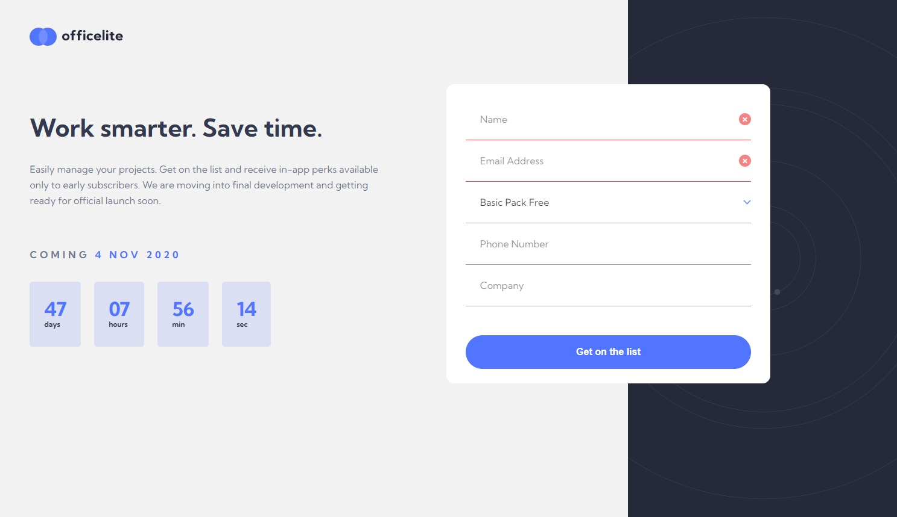

# Frontend Mentor - Officelite coming soon site solution

This is a solution to the [Officelite coming soon site challenge on Frontend Mentor](https://www.frontendmentor.io/challenges/officelite-coming-soon-site-M4DIPNz8g). Frontend Mentor challenges help you improve your coding skills by building realistic projects. 

## Table of contents

- [Overview](#overview)
  - [The challenge](#the-challenge)
  - [Screenshot](#screenshot)
  - [Links](#links)
- [My process](#my-process)
  - [Built with](#built-with)
  - [What I learned](#what-i-learned)
  - [Continued development](#continued-development)
- [Author](#author)

## Overview

### The challenge

Users should be able to:

- View the optimal layout for the site depending on their device's screen size: mobile, tablet and desktop
- See hover states for all interactive elements on the page
- See error states when the contact form is submitted if:
  - The `Name` and/or `Email Address` fields are empty
  - The `Email Address` is not formatted correctly
- **Bonus**: See a live countdown timer that ticks down every second
- **Bonus**: See a custom-styled `select` form control in the sign-up form

### Screenshot



### Links

- Solution URL: [Add solution URL here](https://your-solution-url.com)
- Live Site URL: [Add live site URL here](https://your-live-site-url.com)

## My process
First time use of version control (GIT) via VSCode
First time use of Figma and the Figma designs provided with the challenge
First time use of custom variables in CSS, which explanes some redundant types.

Practiced BEM classifications and payed attention to logical naming convention, writing clean and readable code.


### Built with

- Semantic HTML5 markup
- CSS custom properties
- Flexbox
- CSS Grid
- Mobile-first workflow
- custom variables
- BEM method


### What I learned
Day 1: Time spend programming; 3 hours.
Summary: Started with examining the project, downloading the files and setting everything up. Completed the header section for mobile.  
Details: Started designing mobile first after initial commit and global style settings.
Practiced custom variables in CSS, BEM method classifications, staging and commiting to GIT and first user experience with Figma. Needed some extra time with positioning the background image. 

Day2: Time spend programming; 3 hours.
Summary: Finished the mobile version of the homepage and continued with the signup page. 
Details: Having some light struggles with overlapping elements. Not sure if I'm using the right approach with negative margins. The heights of the background elements are challenging but overall it worked out. The next challenge is completion of the form. 

Day3: Time spend programming; 2.5 hours.
Summary: Edited the form. Had difficulties with the styling the select menu, and went on reading documentations. Ended the morning with a small succes with :invalid. The icons were rigth there in the image folder!! Made life easier. 

Day 4: Time spend programming: 5 hours.
Summary: Practiced grid for a while and flexbox. Both with different approaches. Keeping the layout close to the design was challenging. 

Day 5: Time spend programming: 3.5 hours.
Summary: I got stuck at the sign-up page on the desktop version. I had to do some research to find on answer to the overlapping element and did a big refactoring of the html to get to a solution I'm happy with. 

Day 6: Time spend programming: 1.5 hours.
Summary: Got back to the project to add a functioning timer. Fixed the layout jumping of the timer in CSS on both pages.

Total time spend on the project: 18.5 hours.

Here are the major learnings in this project:
1. before coding, go through all designs. Analyse the project and work it all out on paper to avoid running in to surpises. List the things that are going to be challenging and the things that you don't know how to do. And start with doing research on those things untill you have a clear picture of how to code the design.
2. forms are quite hard to style and require some up front investigation.
3. overlapping content is challenging if the design jumps around on different screensizes. But grid offers a great solution or you can just let content overflow in to the next element and then control the z-index.
4. version control via VScode is easy :) 


code snippets I'm proud of, see below:

```css
main {
    max-width: 600px;
    margin: 0 auto;
    position: relative;
    z-index: 1;
}

body {
        display: grid;
        grid-template-columns: 70% 30%;
    }

    header {
        height: 100vh;
        background-image: none;
    }

    footer {
        height: 100vh;
    }

    main {
        max-width: none;
        text-align: left;
        margin-top: 4em;
        display: grid;
        grid-template-columns: 40vw 40vw;
        column-gap: 4rem;
    }
```

### Continued development

Form styling and client side validation.
Overlapping of element.
## Author

- Website - [Add your name here](https://www.your-site.com)
- Frontend Mentor - [@RikvanderSar](https://www.frontendmentor.io/profile/RikvanderSar)
- LinkedIn - [rikvandersar](www.linkedin.com/in/rikvandersar)
